# Vue-Element-Plus-SpringBoot 图书管理系统

Name: Vue-Element-Plus-SpringBoot 图书管理系统
Author: KSaMar
Date: 2023/4/15 - 2023/5/3
Description: Vue-Element-Plus-SpringBoot 图书管理系统

# 一、项目介绍

使用Vue+Element 前端技术 与 Java SpringBoot 后端技术制作的图书管理系统，功能包含，管理员图书管理功能，用户管理功能等

## 技术栈

### 前端

Vue3

Element Plus

Element Icon

Axios

JS-Cookie

### 后端

Spring Boot

JPA

FastJson

### 数据库

MySql

### 软件

IDEA 2021.3.2

### 用户信息

管理员账号：Admin

管理员密码：123456

普通用户账号：张三

普通用户密码：123456

## 项目详细介绍

本图书管理系统分为两大部分，普通用户模块，与管理员用户模块

管理员用户模块拥有，图书管理功能，图书借阅功能，图书归还功能，超时图书查询功能，用户管理功能与系统设置功能

图书管理功能：管理员可以添加、删除、更改、搜索图书

图书借阅功能：管理员可以输入图书信息与用户信息进行图书借阅

图书归还功能：管理员可以归还用户所需归还的图书

超时图书查询功能：管理员可以查询那些图书超时未归还

用户管理功能：管理员可以添加、删除、更改、搜索用户

系统设置值功能：管理员可以设置管理员密码，添加、删除图书种类

普通用户模块拥有，图书查询功能，个人信息显示功能

图书查询功能：用户可以查询图书信息，查看图书是否可借阅

个人信息显示功能：显示用户的个人信息与借阅的图书信息

# 二、项目图片

## 项目结构

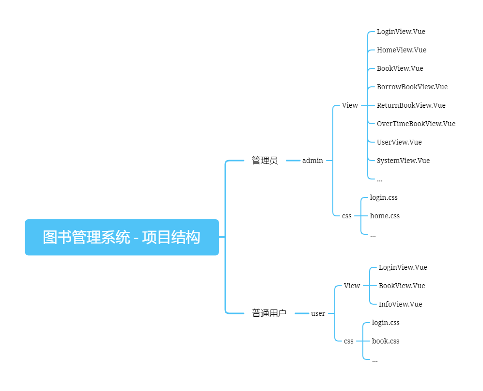

## 技术栈

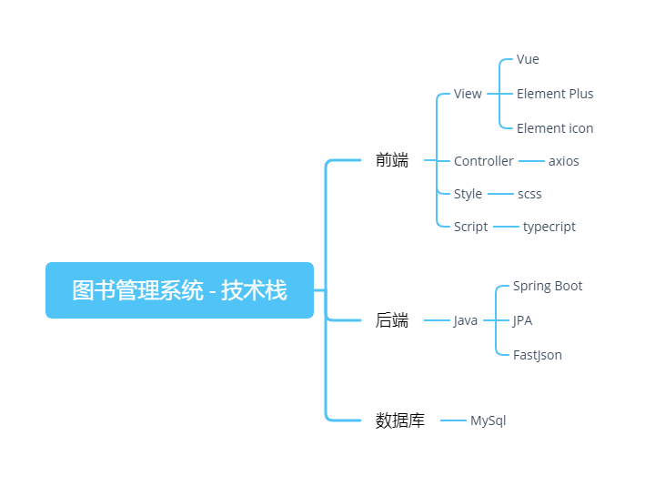

## 管理员功能

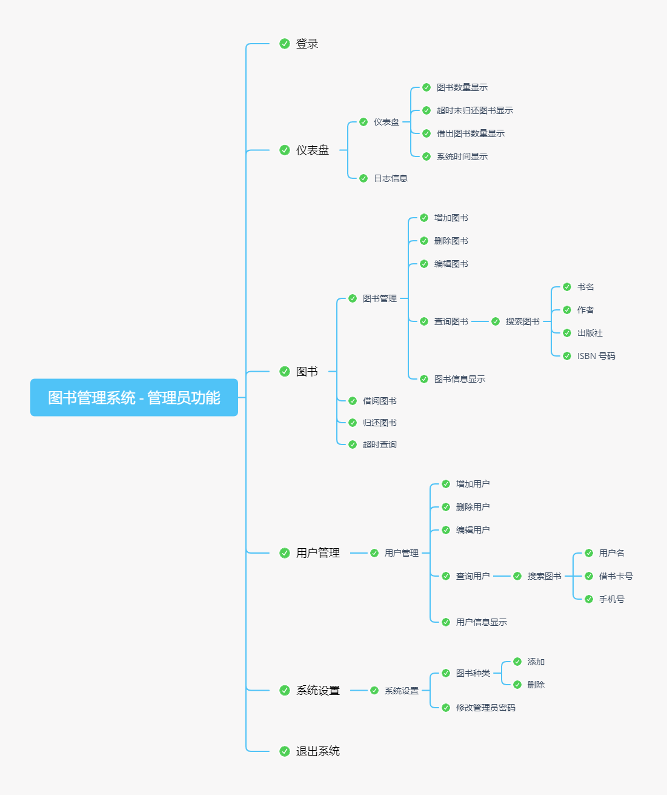

## 普通用户功能

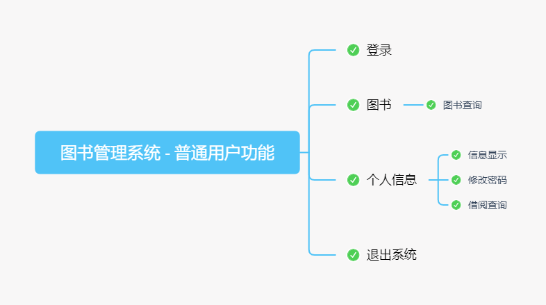

## 数据库结构

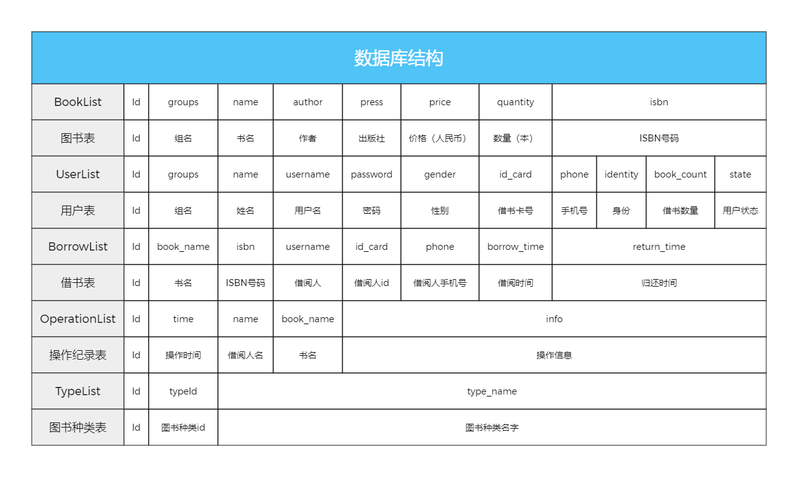

## 管理员登录页面

## 仪表盘页面

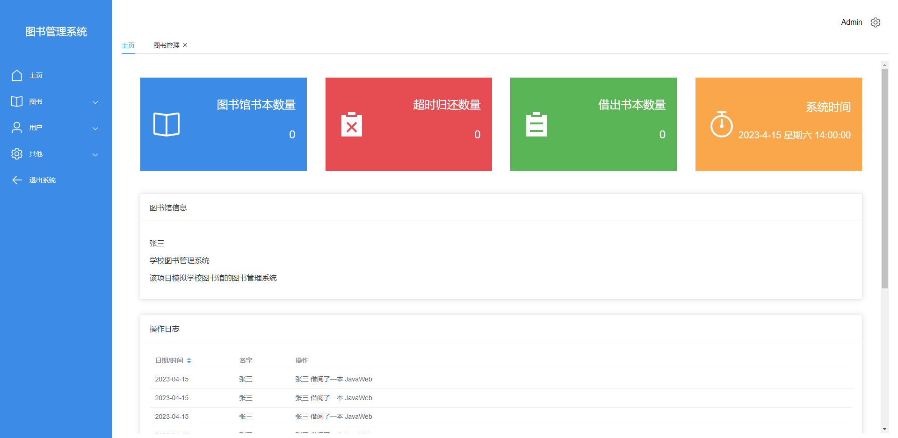

## 图书管理页面

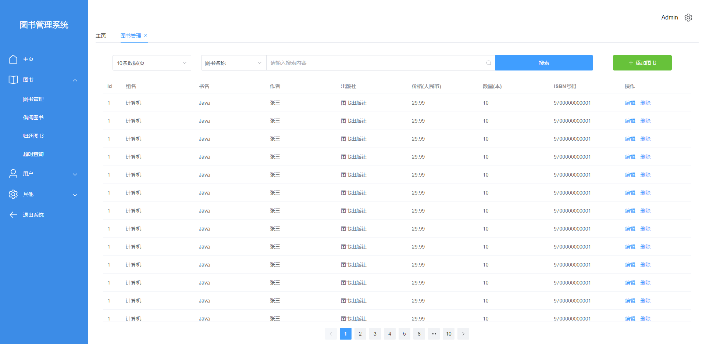

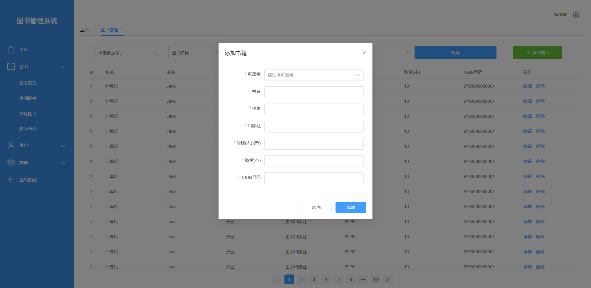

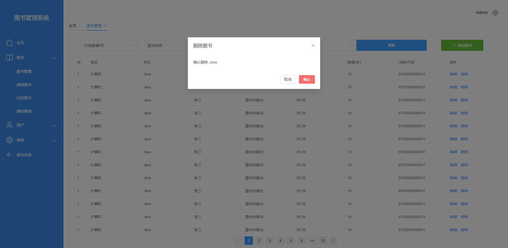

## 借阅图书页面

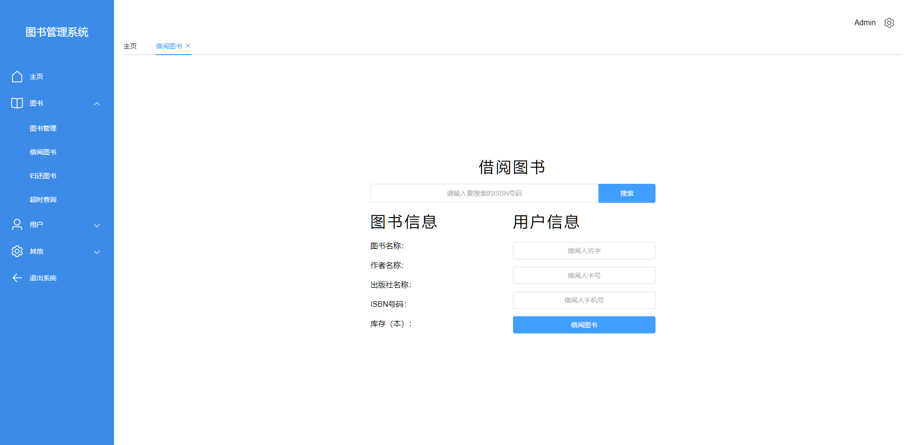

## 归还图书页面

## 超时查询页面

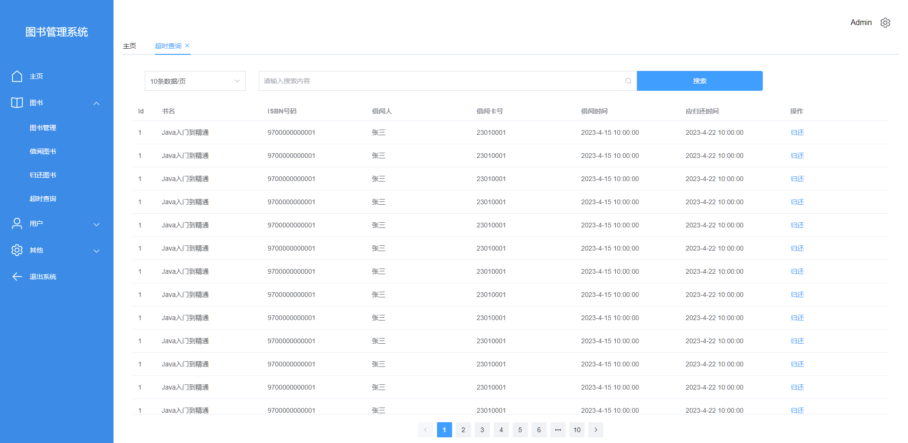

## 用户管理页面

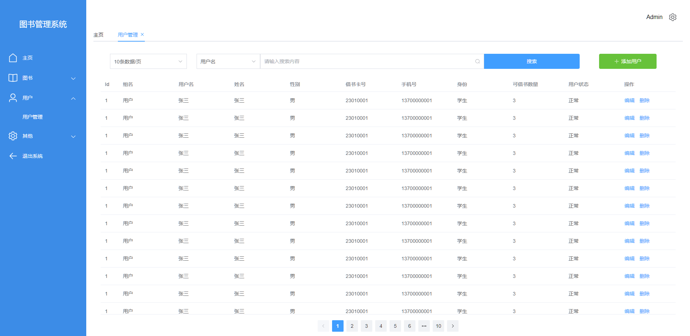

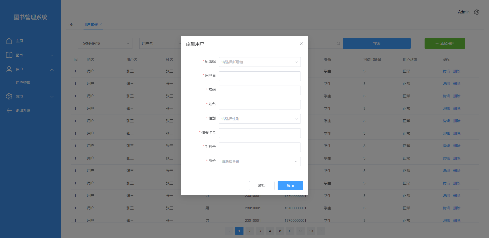

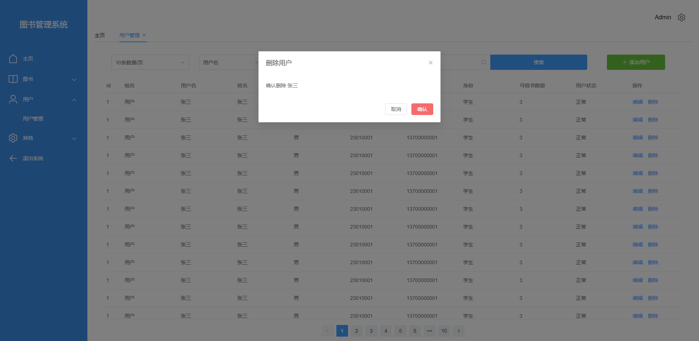

## 系统设置页面

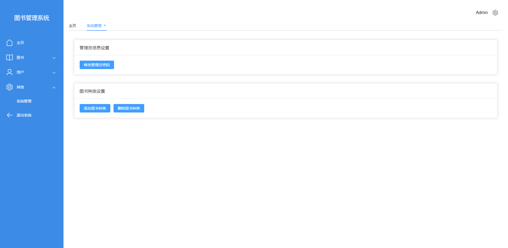

## 用户登录页面

## 用户图书信息页面

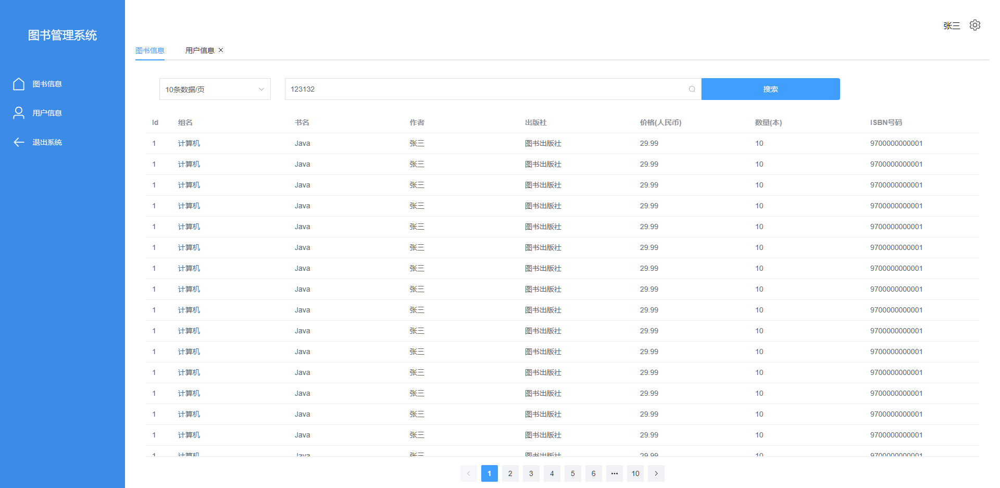

## 用户个人信息页面

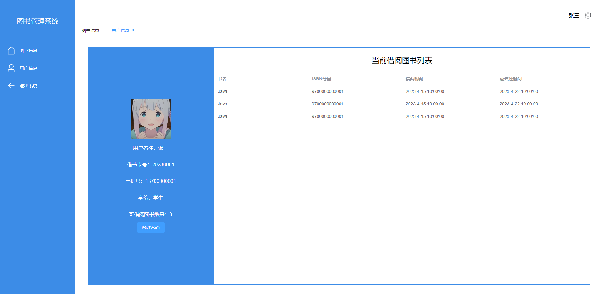

